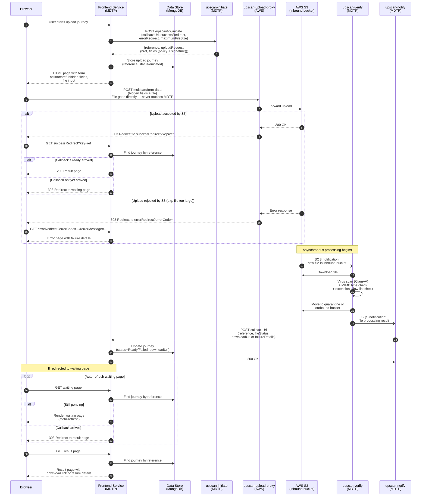
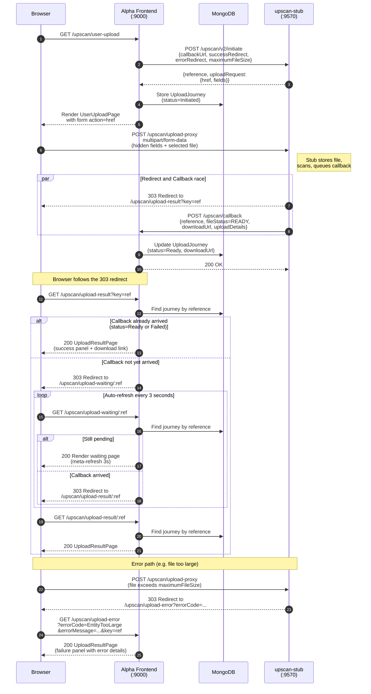
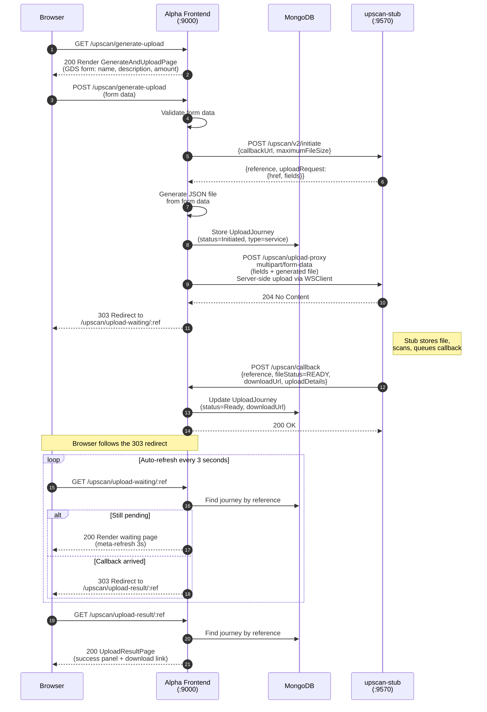

# digital-disclosure-service-alpha-frontend

An HMRC Alpha frontend service for the Digital Disclosure Service, built with Play 3 (Scala 3) and HMRC bootstrap-frontend-play-30.

This service includes a proof-of-concept integration with **Upscan** — HMRC's file upload service — demonstrating two distinct upload use cases.

---

## Upscan Integration

### What is Upscan?

Upscan is HMRC's file upload service that enables consuming services to orchestrate file uploads from external sources (members of the public or third-party services). It provides:

- **Temporary storage** of uploaded files on AWS S3
- **Virus scanning** of all uploaded files (via ClamAV in `upscan-verify`)
- **File type validation** against a per-service allow list
- **File size validation** against configurable min/max constraints
- **Asynchronous notification** to consuming services via callbacks

Upscan is **not** for transferring files between HMRC services — it exists to bring files from outside the MDTP estate in safely.

### How Upscan Works in Production

In production, Upscan is a suite of microservices that coordinate file uploads through AWS S3 with virus scanning and async notification:



#### Key points:

1. **The file never passes through the frontend service** (for user uploads). It goes directly from the browser to S3 via `upscan-upload-proxy`, avoiding MDTP bandwidth and security concerns.
2. **The pre-signed URL is time-limited** (7 days) and the hidden form fields contain an AWS policy and signature that authorise the specific upload.
3. **Callbacks are asynchronous** — the service must poll or store state to know when verification is complete. There is a race between the S3 redirect back to the user and the callback arriving.
4. **The download URL expires** (default 1 day, configurable per service, max 6 hours in newer config). For longer retention, integrate with `object-store`.
5. **Failed callbacks are retried** up to 30 times at 60-second intervals.
6. **Failure reasons**: `QUARANTINE` (virus found), `REJECTED` (disallowed MIME type or extension), `UNKNOWN` (other error).

### The Two Use Cases in This PoC

#### Use Case 1: User File Upload (client-side)

This is the standard Upscan pattern where a user selects and uploads a file from their browser.



**Key code:**
- `UpscanController.userUpload` — initiates the upload and renders the form
- `UserUploadPage.scala.html` — the GDS-styled page with the S3 upload form
- `UpscanCallbackController.callback` — receives and stores the async callback

#### Use Case 2: Service-Generated File Upload (server-side)

This pattern is for when the service itself generates a file (e.g. from form data, a PDF report, or a JSON summary) and needs to upload it to Upscan for virus scanning and storage.



**Key code:**
- `UpscanController.submitGenerateForm` — validates form, initiates upload, generates file, uploads to S3
- `UpscanConnector.uploadFile` — performs the server-side multipart POST to S3
- `GenerateAndUploadPage.scala.html` — GDS form for entering disclosure data
- `UploadWaitingPage.scala.html` — auto-refreshing waiting page

### Upscan Initiate API

#### `POST /upscan/v2/initiate`

**Request body:**
```json
{
  "callbackUrl": "http://localhost:9000/.../upscan/callback",
  "successRedirect": "http://localhost:9000/.../upscan/upload-result",
  "errorRedirect": "http://localhost:9000/.../upscan/upload-error",
  "minimumFileSize": 0,
  "maximumFileSize": 10485760
}
```

**Response:**
```json
{
  "reference": "11370e18-6e24-453e-b45a-76d3e32ea33d",
  "uploadRequest": {
    "href": "http://localhost:9570/upscan/upload-proxy",
    "fields": {
      "acl": "private",
      "key": "11370e18-6e24-453e-b45a-76d3e32ea33d",
      "policy": "xxxxxxxx==",
      "x-amz-algorithm": "AWS4-HMAC-SHA256",
      "x-amz-credential": "...",
      "x-amz-date": "...",
      "x-amz-meta-callback-url": "...",
      "x-amz-signature": "...",
      "success_action_redirect": "...",
      "error_action_redirect": "..."
    }
  }
}
```

### Upscan Callback Payload

**Success:**
```json
{
  "reference": "11370e18-6e24-453e-b45a-76d3e32ea33d",
  "fileStatus": "READY",
  "downloadUrl": "http://localhost:9570/upscan/download/...",
  "uploadDetails": {
    "fileName": "test.pdf",
    "fileMimeType": "application/pdf",
    "uploadTimestamp": "2026-05-15T09:30:00Z",
    "checksum": "396f101d...",
    "size": 987
  }
}
```

**Failure (virus, rejected type, or unknown):**
```json
{
  "reference": "11370e18-6e24-453e-b45a-76d3e32ea33d",
  "fileStatus": "FAILED",
  "failureDetails": {
    "failureReason": "QUARANTINE",
    "message": "This file has a virus"
  }
}
```

### Important Rules

- **Do NOT hardcode** the `fields` from the initiate response — they change between environments and over time
- **Use `multipart/form-data`** encoding, NOT `application/x-www-form-urlencoded`
- **The file must be the last field** in the multipart form
- **Callback URLs must use HTTPS** in production (HTTP is allowed for localhost only)
- **Callback URLs must not contain sensitive data** (user IDs, session tokens) as they are visible in the upload request
- **Download URLs expire** — if you need longer storage, integrate with `object-store`

---

## Running Locally

### Prerequisites

- **sbt** (1.10.x)
- **MongoDB** running on `localhost:27017`
- **upscan-stub** running on `localhost:9570`

### Start dependencies

```bash
# Start MongoDB (if not already running)
mongod --dbpath /tmp/mongo

# Start upscan-stub (from the upscan-stub directory)
sbt "run 9570"

# Or via Service Manager:
sm2 --start UPSCAN_STUB
```

### Start this service

```bash
cd digital-disclosure-service-alpha-frontend
sbt run
```

The service starts on `http://localhost:9000`.

### Access the Upscan PoC

Navigate to: `http://localhost:9000/digital-disclosure-service-alpha-frontend/upscan`

From there you can try both upload use cases.

### Testing error scenarios with upscan-stub

The upscan-stub supports testing error scenarios by naming files with special prefixes:
- `reject.ErrorCode.ext` — simulates an S3 error (e.g. `reject.EntityTooLarge.pdf`)
- `infected.VirusName.ext` — simulates a quarantined file (e.g. `infected.Eicar.txt`)
- `invalid.Reason.ext` — simulates a rejected file type (e.g. `invalid.BadType.doc`)

---

## Project Structure (Upscan-specific)

```
app/
  uk/gov/hmrc/digitaldisclosureservicealphafrontend/
    config/
      AppConfig.scala              — Configuration values (selfUrl for callbacks)
    connectors/
      UpscanConnector.scala        — HTTP client for upscan-initiate + server-side S3 upload
    controllers/
      UpscanController.scala       — All upload pages and flows
      UpscanCallbackController.scala — Receives async callbacks from Upscan
    models/
      UpscanModels.scala           — Upscan API request/response/callback models
      UploadJourney.scala          — MongoDB model for tracking upload state
    repositories/
      UploadJourneyRepository.scala — MongoDB repository with TTL index
    views/
      UpscanDemoPage.scala.html    — Landing page with both demo options
      UserUploadPage.scala.html    — GDS file upload page (form posts to S3)
      GenerateAndUploadPage.scala.html — GDS form for disclosure data entry
      UploadWaitingPage.scala.html — Auto-refreshing waiting page
      UploadResultPage.scala.html  — Success/failure result page
conf/
  app.routes                       — Route definitions including CSRF-exempt callback
  application.conf                 — upscan-initiate and MongoDB configuration
  messages                         — All GDS page content
```

---

### License

This code is open source software licensed under the [Apache 2.0 License]("http://www.apache.org/licenses/LICENSE-2.0.html").
