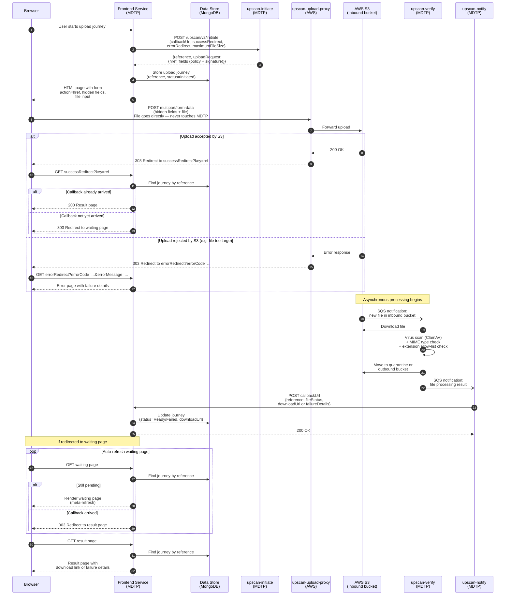
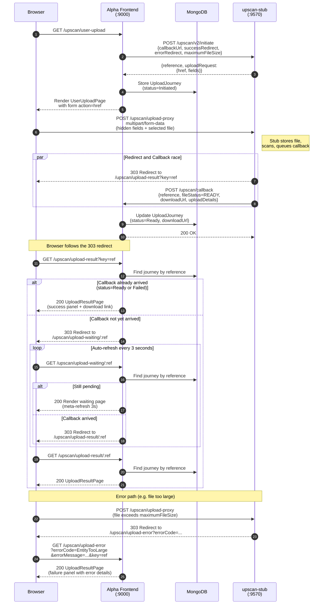
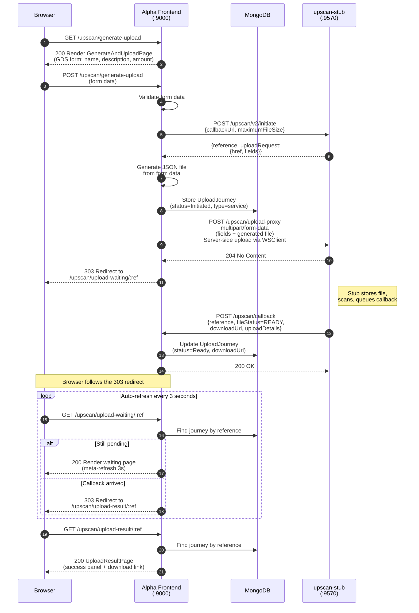
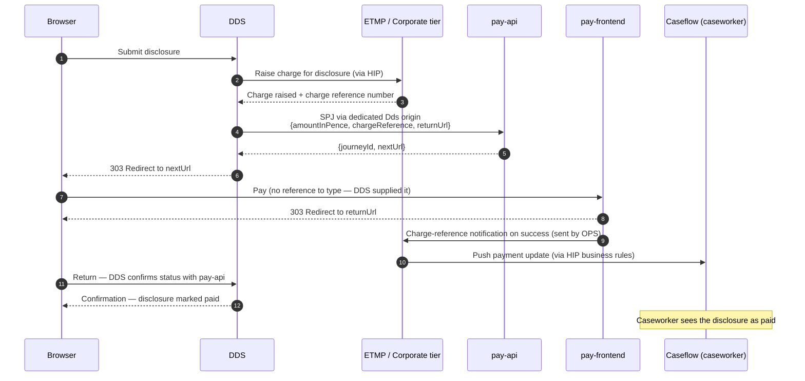
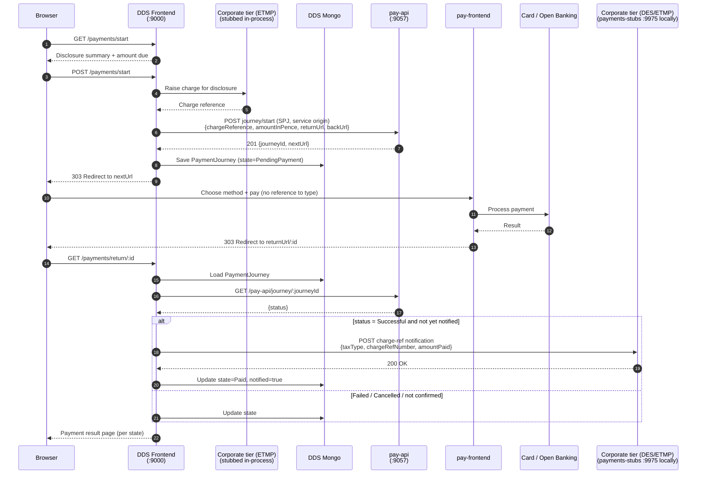

# digital-disclosure-service-alpha-frontend

An HMRC Alpha frontend service for the Digital Disclosure Service (DDS), built with Play 3 (Scala 3) and HMRC bootstrap-frontend-play-30.

It contains two proof-of-concept (PoC) integrations that explore how the future DDS service will work:

- **Upscan** — HMRC's file upload service — for safely uploading files supporting a disclosure (two upload patterns are demonstrated).
- **OPS (Online Payment Service)** — for taking payment for a disclosure by handing off to `pay-frontend` via `pay-api`.

Each integration is explained in its own section below, followed by a single guide to [running the service locally](#running-locally).

---

## Upscan Integration

### What is Upscan?

Upscan is HMRC's file upload service that enables consuming services to orchestrate file uploads from external sources (members of the public or third-party services). It provides:

- **Temporary storage** of uploaded files on AWS S3
- **Virus scanning** of all uploaded files (via ClamAV in `upscan-verify`)
- **File type validation** against a per-service allow list
- **File size validation** against configurable min/max constraints
- **Asynchronous notification** to consuming services via callbacks

Upscan is **not** for transferring files between HMRC services — it exists to bring files from outside the MDTP estate in safely.

### How Upscan Works in Production

In production, Upscan is a suite of microservices that coordinate file uploads through AWS S3 with virus scanning and async notification:


```mermaid
sequenceDiagram
    autonumber
    participant Browser
    participant Frontend as Frontend Service<br/>(MDTP)
    participant DB as Data Store<br/>(MongoDB)
    participant Initiate as upscan-initiate<br/>(MDTP)
    participant Proxy as upscan-upload-proxy<br/>(AWS)
    participant S3 as AWS S3<br/>(Inbound bucket)
    participant Verify as upscan-verify<br/>(MDTP)
    participant Notify as upscan-notify<br/>(MDTP)

    Browser->>Frontend: User starts upload journey
    Frontend->>Initiate: POST /upscan/v2/initiate<br/>{callbackUrl, successRedirect,<br/>errorRedirect, maximumFileSize}
    Initiate-->>Frontend: {reference, uploadRequest:<br/>{href, fields (policy + signature)}}
    Frontend->>DB: Store upload journey<br/>(reference, status=Initiated)
    Frontend-->>Browser: HTML page with form<br/>action=href, hidden fields,<br/>file input

    Browser->>Proxy: POST multipart/form-data<br/>(hidden fields + file)<br/>File goes directly — never touches MDTP
    Proxy->>S3: Forward upload

    alt Upload accepted by S3
        S3-->>Proxy: 200 OK
        Proxy-->>Browser: 303 Redirect to successRedirect?key=ref
        Browser->>Frontend: GET successRedirect?key=ref
        Frontend->>DB: Find journey by reference
        alt Callback already arrived
            Frontend-->>Browser: 200 Result page
        else Callback not yet arrived
            Frontend-->>Browser: 303 Redirect to waiting page
        end
    else Upload rejected by S3 (e.g. file too large)
        S3-->>Proxy: Error response
        Proxy-->>Browser: 303 Redirect to errorRedirect?errorCode=...
        Browser->>Frontend: GET errorRedirect?errorCode=...&errorMessage=...
        Frontend-->>Browser: Error page with failure details
    end

    Note over S3,Verify: Asynchronous processing begins

    S3-)Verify: SQS notification:<br/>new file in inbound bucket
    Verify->>S3: Download file
    Verify->>Verify: Virus scan (ClamAV)<br/>+ MIME type check<br/>+ extension allow-list check
    Verify->>S3: Move to quarantine or<br/>outbound bucket

    Verify-)Notify: SQS notification:<br/>file processing result
    Notify->>Frontend: POST callbackUrl<br/>{reference, fileStatus,<br/>downloadUrl or failureDetails}
    Frontend->>DB: Update journey<br/>(status=Ready/Failed, downloadUrl)
    Frontend-->>Notify: 200 OK

    Note over Browser,Frontend: If redirected to waiting page

    loop Auto-refresh waiting page
        Browser->>Frontend: GET waiting page
        Frontend->>DB: Find journey by reference
        alt Still pending
            Frontend-->>Browser: Render waiting page<br/>(meta-refresh)
        else Callback arrived
            Frontend-->>Browser: 303 Redirect to result page
        end
    end

    Browser->>Frontend: GET result page
    Frontend->>DB: Find journey by reference
    Frontend-->>Browser: Result page with<br/>download link or failure details
```

#### Key points:

1. **The file never passes through the frontend service** (for user uploads). It goes directly from the browser to S3 via `upscan-upload-proxy`, avoiding MDTP bandwidth and security concerns.
2. **The pre-signed URL is time-limited** (7 days) and the hidden form fields contain an AWS policy and signature that authorise the specific upload.
3. **Callbacks are asynchronous** — the service must poll or store state to know when verification is complete. There is a race between the S3 redirect back to the user and the callback arriving.
4. **The download URL expires** (default 1 day, configurable per service, max 6 hours in newer config). For longer retention, integrate with `object-store`.
5. **Failed callbacks are retried** up to 30 times at 60-second intervals.
6. **Failure reasons**: `QUARANTINE` (virus found), `REJECTED` (disallowed MIME type or extension), `UNKNOWN` (other error).

### The Two Use Cases in This PoC

#### Use Case 1: User File Upload (client-side)

This is the standard Upscan pattern where a user selects and uploads a file from their browser.


```mermaid
sequenceDiagram
    autonumber
    participant User as Browser
    participant FE as Alpha Frontend<br/>(:9000)
    participant Mongo as MongoDB
    participant Stub as upscan-stub<br/>(:9570)

    User->>FE: GET /upscan/user-upload
    FE->>Stub: POST /upscan/v2/initiate<br/>{callbackUrl, successRedirect,<br/>errorRedirect, maximumFileSize}
    Stub-->>FE: {reference, uploadRequest:<br/>{href, fields}}
    FE->>Mongo: Store UploadJourney<br/>(status=Initiated)
    FE-->>User: Render UserUploadPage<br/>with form action=href

    User->>Stub: POST /upscan/upload-proxy<br/>multipart/form-data<br/>(hidden fields + selected file)
    Note right of Stub: Stub stores file,<br/>scans, queues callback

    par Redirect and Callback race
        Stub-->>User: 303 Redirect to<br/>/upscan/upload-result?key=ref
        Stub->>FE: POST /upscan/callback<br/>{reference, fileStatus=READY,<br/>downloadUrl, uploadDetails}
    end

    FE->>Mongo: Update UploadJourney<br/>(status=Ready, downloadUrl)
    FE-->>Stub: 200 OK

    Note over User,FE: Browser follows the 303 redirect

    User->>FE: GET /upscan/upload-result?key=ref
    FE->>Mongo: Find journey by reference

    alt Callback already arrived (status=Ready or Failed)
        FE-->>User: 200 UploadResultPage<br/>(success panel + download link)
    else Callback not yet arrived
        FE-->>User: 303 Redirect to<br/>/upscan/upload-waiting/:ref
        loop Auto-refresh every 3 seconds
            User->>FE: GET /upscan/upload-waiting/:ref
            FE->>Mongo: Find journey by reference
            alt Still pending
                FE-->>User: 200 Render waiting page<br/>(meta-refresh 3s)
            else Callback arrived
                FE-->>User: 303 Redirect to<br/>/upscan/upload-result/:ref
            end
        end
        User->>FE: GET /upscan/upload-result/:ref
        FE->>Mongo: Find journey by reference
        FE-->>User: 200 UploadResultPage
    end

    Note over User,Stub: Error path (e.g. file too large)

    User->>Stub: POST /upscan/upload-proxy<br/>(file exceeds maximumFileSize)
    Stub-->>User: 303 Redirect to<br/>/upscan/upload-error?errorCode=...
    User->>FE: GET /upscan/upload-error<br/>?errorCode=EntityTooLarge<br/>&errorMessage=...&key=ref
    FE-->>User: 200 UploadResultPage<br/>(failure panel with error details)
```

**Key code:**
- `UpscanController.userUpload` — initiates the upload and renders the form
- `UserUploadPage.scala.html` — the GDS-styled page with the S3 upload form
- `UpscanCallbackController.callback` — receives and stores the async callback

#### Use Case 2: Service-Generated File Upload (server-side)

This pattern is for when the service itself generates a file (e.g. from form data, a PDF report, or a JSON summary) and needs to upload it to Upscan for virus scanning and storage.


```mermaid
sequenceDiagram
    autonumber
    participant User as Browser
    participant FE as Alpha Frontend<br/>(:9000)
    participant Mongo as MongoDB
    participant Stub as upscan-stub<br/>(:9570)

    User->>FE: GET /upscan/generate-upload
    FE-->>User: 200 Render GenerateAndUploadPage<br/>(GDS form: name, description, amount)

    User->>FE: POST /upscan/generate-upload<br/>(form data)
    FE->>FE: Validate form data

    FE->>Stub: POST /upscan/v2/initiate<br/>{callbackUrl, maximumFileSize}
    Stub-->>FE: {reference, uploadRequest:<br/>{href, fields}}

    FE->>FE: Generate JSON file<br/>from form data
    FE->>Mongo: Store UploadJourney<br/>(status=Initiated, type=service)

    FE->>Stub: POST /upscan/upload-proxy<br/>multipart/form-data<br/>(fields + generated file)<br/>Server-side upload via WSClient
    Stub-->>FE: 204 No Content

    FE-->>User: 303 Redirect to<br/>/upscan/upload-waiting/:ref

    Note right of Stub: Stub stores file,<br/>scans, queues callback

    Stub->>FE: POST /upscan/callback<br/>{reference, fileStatus=READY,<br/>downloadUrl, uploadDetails}
    FE->>Mongo: Update UploadJourney<br/>(status=Ready, downloadUrl)
    FE-->>Stub: 200 OK

    Note over User,FE: Browser follows the 303 redirect

    loop Auto-refresh every 3 seconds
        User->>FE: GET /upscan/upload-waiting/:ref
        FE->>Mongo: Find journey by reference
        alt Still pending
            FE-->>User: 200 Render waiting page<br/>(meta-refresh 3s)
        else Callback arrived
            FE-->>User: 303 Redirect to<br/>/upscan/upload-result/:ref
        end
    end

    User->>FE: GET /upscan/upload-result/:ref
    FE->>Mongo: Find journey by reference
    FE-->>User: 200 UploadResultPage<br/>(success panel + download link)
```

**Key code:**
- `UpscanController.submitGenerateForm` — validates form, initiates upload, generates file, uploads to S3
- `UpscanConnector.uploadFile` — performs the server-side multipart POST to S3
- `GenerateAndUploadPage.scala.html` — GDS form for entering disclosure data
- `UploadWaitingPage.scala.html` — auto-refreshing waiting page

### Upscan Initiate API

#### `POST /upscan/v2/initiate`

**Request body:**
```json
{
  "callbackUrl": "http://localhost:9000/.../upscan/callback",
  "successRedirect": "http://localhost:9000/.../upscan/upload-result",
  "errorRedirect": "http://localhost:9000/.../upscan/upload-error",
  "minimumFileSize": 0,
  "maximumFileSize": 10485760
}
```

**Response:**
```json
{
  "reference": "11370e18-6e24-453e-b45a-76d3e32ea33d",
  "uploadRequest": {
    "href": "http://localhost:9570/upscan/upload-proxy",
    "fields": {
      "acl": "private",
      "key": "11370e18-6e24-453e-b45a-76d3e32ea33d",
      "policy": "xxxxxxxx==",
      "x-amz-algorithm": "AWS4-HMAC-SHA256",
      "x-amz-credential": "...",
      "x-amz-date": "...",
      "x-amz-meta-callback-url": "...",
      "x-amz-signature": "...",
      "success_action_redirect": "...",
      "error_action_redirect": "..."
    }
  }
}
```

### Upscan Callback Payload

**Success:**
```json
{
  "reference": "11370e18-6e24-453e-b45a-76d3e32ea33d",
  "fileStatus": "READY",
  "downloadUrl": "http://localhost:9570/upscan/download/...",
  "uploadDetails": {
    "fileName": "test.pdf",
    "fileMimeType": "application/pdf",
    "uploadTimestamp": "2026-05-15T09:30:00Z",
    "checksum": "396f101d...",
    "size": 987
  }
}
```

**Failure (virus, rejected type, or unknown):**
```json
{
  "reference": "11370e18-6e24-453e-b45a-76d3e32ea33d",
  "fileStatus": "FAILED",
  "failureDetails": {
    "failureReason": "QUARANTINE",
    "message": "This file has a virus"
  }
}
```

### Important Rules

- **Do NOT hardcode** the `fields` from the initiate response — they change between environments and over time
- **Use `multipart/form-data`** encoding, NOT `application/x-www-form-urlencoded`
- **The file must be the last field** in the multipart form
- **Callback URLs must use HTTPS** in production (HTTP is allowed for localhost only)
- **Callback URLs must not contain sensitive data** (user IDs, session tokens) as they are visible in the upload request
- **Download URLs expire** — if you need longer storage, integrate with `object-store`

---

## OPS Payments Integration

This service also includes a proof-of-concept integration with **OPS** (the Online Payment Service) — HMRC's platform for taking payments. It demonstrates how DDS would let a user pay for a disclosure by handing off to `pay-frontend` via a Start Payment Journey (SPJ) call to `pay-api`.

### How it works

In the strategic design the payment settles a charge that ETMP raises against the disclosure. The PoC follows the same shape: it starts from a disclosure with an amount due, raises the charge on a **stubbed** corporate tier to obtain a charge reference, and carries that reference (plus the amount and return URL) into the payment journey — so the user never types an amount or a reference. The only stood-in parts are the corporate-tier systems that do not exist locally (ETMP and a dedicated OPS origin). The two diagrams below contrast the intended production flow with what this service actually does. In both, the payment itself never touches DDS.

#### Production


```mermaid
sequenceDiagram
    autonumber
    participant User as Browser
    participant DDS as DDS
    participant ETMP as ETMP / Corporate tier
    participant PayApi as pay-api
    participant PayFE as pay-frontend
    participant Caseflow as Caseflow (caseworker)

    User->>DDS: Submit disclosure
    DDS->>ETMP: Raise charge for disclosure (via HIP)
    ETMP-->>DDS: Charge raised + charge reference number

    DDS->>PayApi: SPJ via dedicated Dds origin<br/>{amountInPence, chargeReference, returnUrl}
    PayApi-->>DDS: {journeyId, nextUrl}
    DDS-->>User: 303 Redirect to nextUrl

    User->>PayFE: Pay (no reference to type — DDS supplied it)
    PayFE-->>User: 303 Redirect to returnUrl
    PayFE->>ETMP: Charge-reference notification on success (sent by OPS)
    ETMP->>Caseflow: Push payment update (via HIP business rules)

    User->>DDS: Return — DDS confirms status with pay-api
    DDS-->>User: Confirmation — disclosure marked paid
    Note over Caseflow: Caseworker sees the disclosure as paid
```

#### Proof of concept (this service)


```mermaid
sequenceDiagram
    autonumber
    participant User as Browser
    participant DDS as DDS Frontend<br/>(:9000)
    participant Etmp as Corporate tier (ETMP)<br/>(stubbed in-process)
    participant Mongo as DDS Mongo
    participant PayApi as pay-api<br/>(:9057)
    participant PayFE as pay-frontend
    participant Bank as Card / Open Banking
    participant Corp as Corporate tier (DES/ETMP)<br/>(payments-stubs :9975 locally)

    User->>DDS: GET /payments/start
    DDS-->>User: Disclosure summary + amount due
    User->>DDS: POST /payments/start
    DDS->>Etmp: Raise charge for disclosure
    Etmp-->>DDS: Charge reference
    DDS->>PayApi: POST journey/start (SPJ, service origin)<br/>{chargeReference, amountInPence, returnUrl, backUrl}
    PayApi-->>DDS: 201 {journeyId, nextUrl}
    DDS->>Mongo: Save PaymentJourney (state=PendingPayment)
    DDS-->>User: 303 Redirect to nextUrl

    User->>PayFE: Choose method + pay (no reference to type)
    PayFE->>Bank: Process payment
    Bank-->>PayFE: Result
    PayFE-->>User: 303 Redirect to returnUrl/:id

    User->>DDS: GET /payments/return/:id
    DDS->>Mongo: Load PaymentJourney
    DDS->>PayApi: GET /pay-api/journey/:journeyId
    PayApi-->>DDS: {status}
    alt status = Successful and not yet notified
        DDS->>Corp: POST charge-ref notification<br/>{taxType, chargeRefNumber, amountPaid}
        Corp-->>DDS: 200 OK
        DDS->>Mongo: Update state=Paid, notified=true
    else Failed / Cancelled / not confirmed
        DDS->>Mongo: Update state
    end
    DDS-->>User: Payment result page (per state)
```

### Key points

- **DDS never sees card or bank details** — they are captured on the Barclaycard / Ecospend hosted pages.
- **The journey runs under an authenticated session.** The payment origins are authenticated journeys, so the payment routes are guarded by an `AuthenticatedAction` — a user with no session is sent to sign in (the auth-login-stub locally). This also supplies the `sessionId` the SPJ call requires; it is not an anonymous server-to-server call.
- **DDS supplies the reference, amount and return URL** — the user types nothing on pay-frontend. This needs a *service origin* (one that accepts `{chargeReference, amountInPence, returnUrl, backUrl}`), not the generic "Other" origin, which discards all of these and asks the user for a reference. The origin is configurable via `payments.start-journey-path`.
- **A dedicated `Dds` origin is an OPS-owned dependency.** The PoC reuses an existing service origin to demonstrate the shape; production needs a dedicated origin added to `pay-api-corcommon` and `pay-api` by the OPS team.
- **The charge is raised before payment.** `EtmpChargeConnector` stubs the corporate-tier step that raises the charge and returns its reference; wiring this to a real ETMP call (via HIP/DES) is the remaining production step.
- **Payment state is persisted, not held in the session.** Each journey is stored in Mongo (`PaymentJourney`) with an explicit lifecycle — `PendingPayment → Paid / Failed / Cancelled` — so the outcome survives the round trip and the return handler is keyed by a DDS-owned id (`/payments/return/:id`).
- **The return URL is not proof of payment** — DDS confirms the journey status via `GET /pay-api/journey/:journeyId` and only advances to `Paid` when pay-api reports `Successful`. Failed, cancelled and unconfirmed outcomes are shown distinctly.
- **The charge-reference notification is idempotent.** On a confirmed successful payment the PoC sends a **charge-reference notification** (`{taxType, chargeRefNumber, amountPaid}` — OPS's own DES contract) to the corporate tier (locally the payments-stubs DES endpoint), then records `notified=true` so a page refresh cannot send it twice. This demonstrates how ETMP would record settlement and a caseworker would see the disclosure as paid. In production this notification is either sent automatically by OPS, or routed to ETMP by the service via HIP.

### Key code

- `AuthenticatedAction` — requires an MDTP session; redirects to sign-in (auth-login-stub locally) otherwise
- `PaymentsController.start` — builds the disclosure context and shows the amount due
- `PaymentsController.startPayment` — raises the charge, builds the SPJ request, persists the journey, and redirects to `nextUrl`
- `PaymentsController.paymentReturn` — loads the journey, confirms status, advances state, and (on first confirmed success) fires the charge-reference notification
- `EtmpChargeConnector` — stubs the corporate-tier step that raises the charge and returns its reference
- `PaymentsConnector` — calls pay-api's SPJ endpoint and the journey status endpoint
- `ChargeNotificationConnector` — sends the charge-reference notification to the corporate tier
- `PaymentJourneyRepository` / `PaymentJourney` — durable journey state (`PaymentState` lifecycle) in Mongo
- `PaymentsModels.scala` — `SpjRequest` / `SpjResponse` / `ChargeRefNotification` / `StubDisclosure` models

---

## Running Locally

### Prerequisites

- **sbt** (1.10.x)
- **MongoDB** on `localhost:27017` (used by the Upscan PoC to track upload journeys)

### Start the service

```bash
cd digital-disclosure-service-alpha-frontend
sbt run
```

The service starts on `http://localhost:9000`. Each PoC also needs its own backing services running, as described below.

### Trying the Upscan PoC

Start the stub, which simulates the Upscan microservices and S3 on port `9570`:

```bash
sm2 --start UPSCAN_STUB
# or, from the upscan-stub directory:
sbt "run 9570"
```

Then go to `http://localhost:9000/digital-disclosure-service-alpha-frontend/upscan` and try either upload use case.

To exercise the failure paths, upscan-stub triggers errors based on the uploaded file's name prefix:

- `reject.ErrorCode.ext` — simulates an S3 error (e.g. `reject.EntityTooLarge.pdf`)
- `infected.VirusName.ext` — simulates a quarantined file (e.g. `infected.Eicar.txt`)
- `invalid.Reason.ext` — simulates a rejected file type (e.g. `invalid.BadType.doc`)

### Trying the OPS Payments PoC

Start the OPS service constellation, which provides `pay-api` (`9057`), `pay-frontend`, and `payments-stubs`:

```bash
sm2 --start OPS_SMALL
```

To complete a full **card** payment you also need `card-payment-frontend` (`:10155`) and the Barclaycard stub, plus `auth-login-stub` (`:9949`) for sign-in — all started by the acceptance profile:

```bash
sm2 --start OPS_ACCEPTANCE
```

The payment origins are **authenticated journeys**, so the PoC requires a signed-in user (this also gives the SPJ call the `sessionId` that pay-api needs). The payment routes are guarded by an `AuthenticatedAction`: if you have no session you are redirected to the **auth-login-stub** ("authority wizard") at `:9949`. Sign in there (the defaults are fine — no specific enrolment is needed) and you are returned to the start page. On a deployed environment `auth.sign-in-url` would point at the real bas-gateway sign-in instead.

The `card-payment` backend (`:10154`) is protected by `internal-auth`, so on a fresh local environment the card journey fails with a 401 after the "check your details" screen (shown to the user as "Sorry, there is a problem with the service"). Seed the token once:

```bash
curl -X POST http://localhost:8470/test-only/token \
  -H "Content-Type: application/json" \
  -d '{
    "token": "123456",
    "principal": "card-payment-frontend",
    "permissions": [
      { "resourceType": "card-payment", "resourceLocation": "*", "actions": ["*"] }
    ]
  }'
```

Then go to `http://localhost:9000/digital-disclosure-service-alpha-frontend/payments/start`. The page shows a sample disclosure with the amount due; continue and you are handed off to pay-frontend. The service supplies the charge reference, amount and return URL, so you choose a payment method and pay **without typing an amount or a reference**.

On a successful payment, the return page reports the confirmed status and the result of the **charge-reference notification**. This is sent to the payments-stubs DES endpoint on `:9975`, which is part of both OPS profiles above — so no extra service is needed. If payments-stubs is not running, the notification fails gracefully and the return page reports that. Failed and cancelled payments return to a distinct result page and are **not** recorded as paid.

> The PoC needs MongoDB running (it persists each payment journey). The `mongodb.uri` defaults to `mongodb://localhost:27017`.

---

## Project Structure

The PoC code is organised by responsibility. Upscan-related files are grouped with the file-upload flow; payments files with the OPS flow.

```
app/
  uk/gov/hmrc/digitaldisclosureservicealphafrontend/
    config/
      AppConfig.scala                  — Typed config (ddsBaseUrl, upscanMaxFileSize, ...)
    connectors/
      UpscanConnector.scala            — upscan-initiate calls + server-side S3 upload
      PaymentsConnector.scala          — pay-api SPJ + journey status calls
      EtmpChargeConnector.scala        — stubbed corporate-tier raise-charge (returns charge reference)
      ChargeNotificationConnector.scala — charge-ref notification to corporate tier
    controllers/
      UpscanController.scala           — Upload pages and flows
      UpscanCallbackController.scala   — Receives async callbacks from Upscan
      PaymentsController.scala         — Raise charge, start payment, persist + handle return
      actions/
        AuthenticatedAction.scala      — Requires a session; redirects to sign-in otherwise
    models/
      UpscanModels.scala               — Upscan request/response/callback models
      UploadJourney.scala              — MongoDB model for upload state
      PaymentsModels.scala             — SpjRequest / SpjResponse / ChargeRefNotification / StubDisclosure
      PaymentJourney.scala             — MongoDB model for payment state (PaymentState lifecycle)
    repositories/
      UploadJourneyRepository.scala    — MongoDB repository with TTL index
      PaymentJourneyRepository.scala   — MongoDB repository for payment journeys (TTL index)
    views/
      UpscanDemoPage.scala.html        — Upscan landing page
      UserUploadPage.scala.html        — GDS file upload page (form posts to S3)
      GenerateAndUploadPage.scala.html — GDS form for disclosure data entry
      UploadWaitingPage.scala.html     — Auto-refreshing waiting page
      UploadResultPage.scala.html      — Upload success/failure result page
      PaymentsStartPage.scala.html     — GDS disclosure summary + amount due page
      PaymentReturnPage.scala.html     — Payment result page on return (per state)
conf/
  app.routes                           — Routes (incl. CSRF-exempt Upscan callback)
  application.conf                     — upscan, pay-api, auth, dds-frontend and MongoDB config
  messages                             — All GDS page content
```

---

### License

This code is open source software licensed under the [Apache 2.0 License]("http://www.apache.org/licenses/LICENSE-2.0.html").
