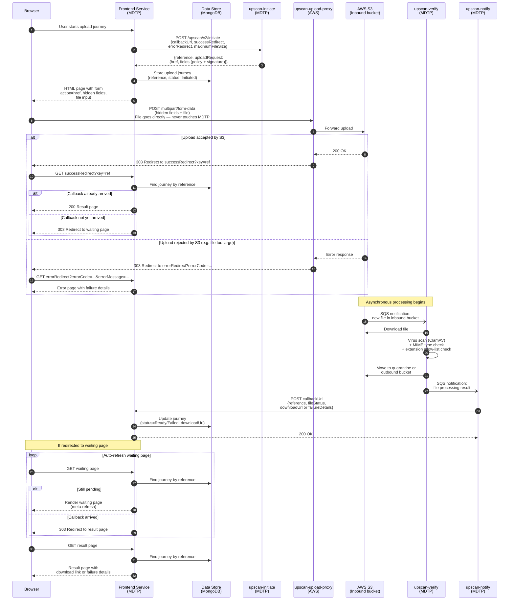
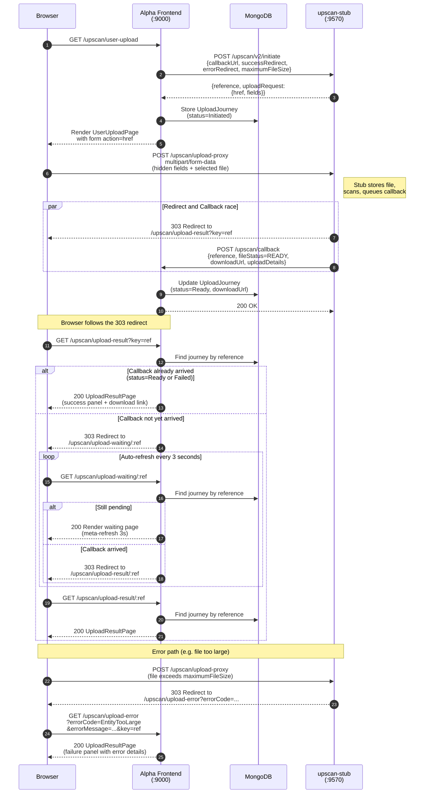
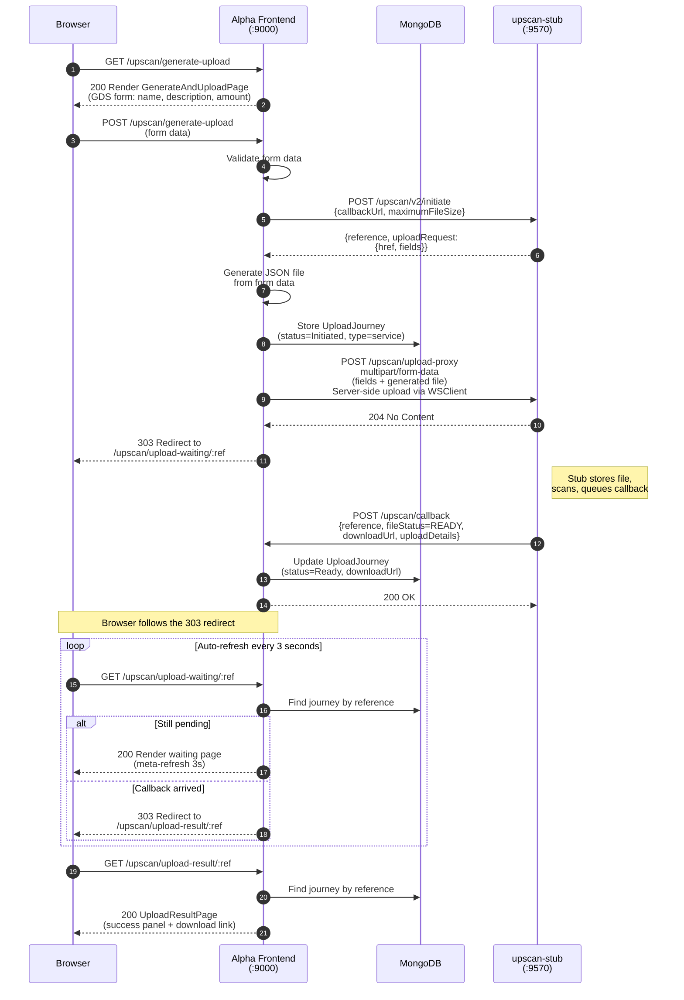
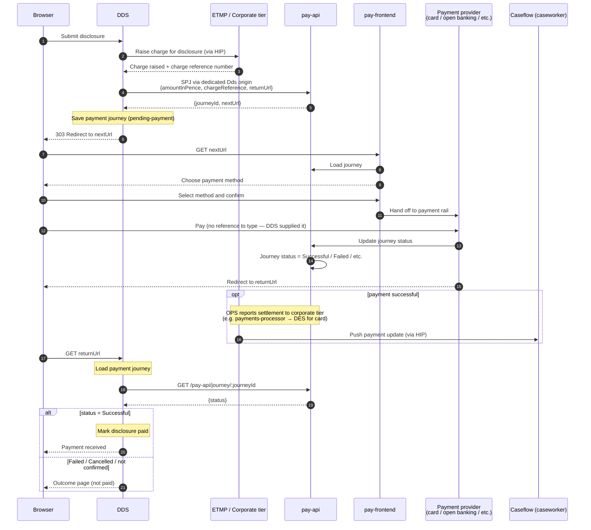
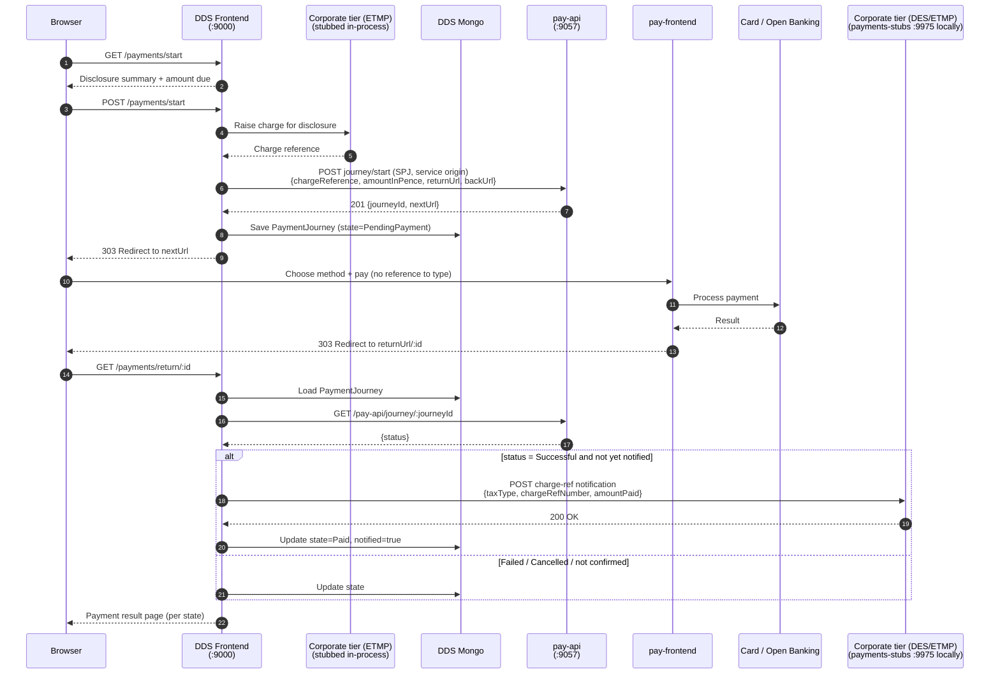
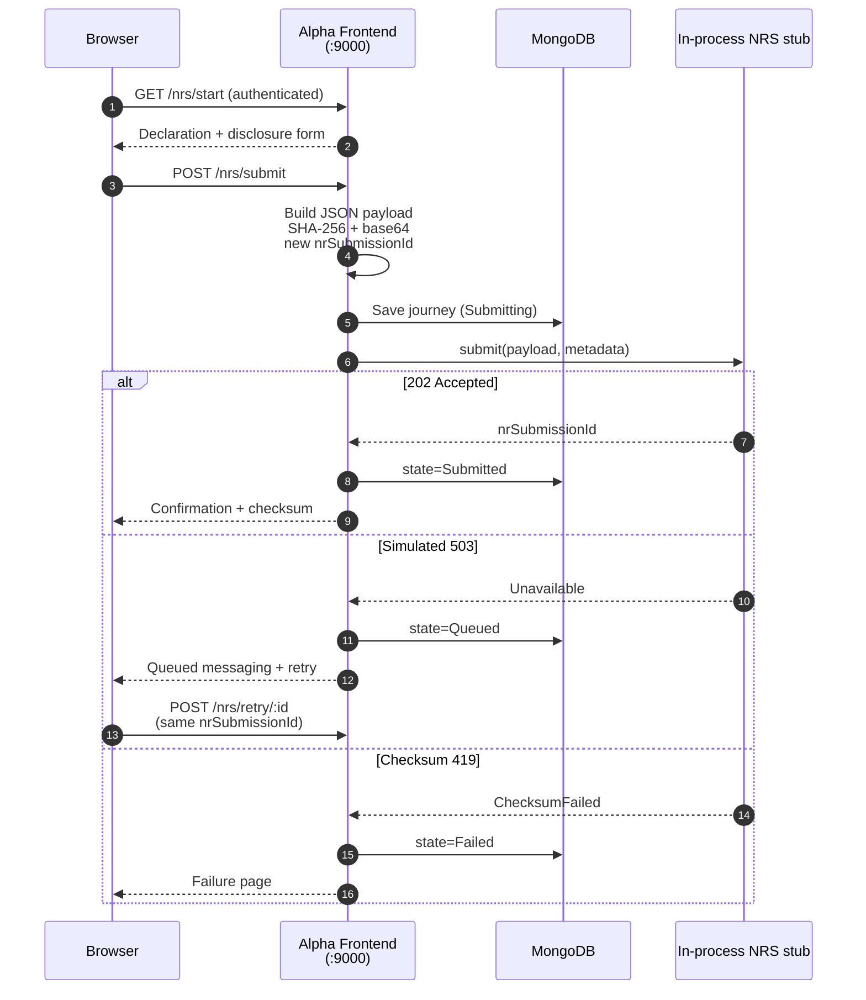
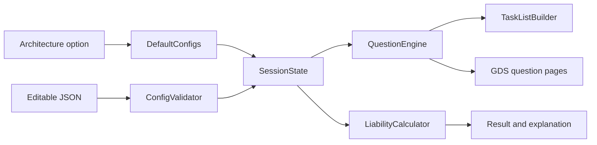

# digital-disclosure-service-alpha-frontend

An HMRC Alpha frontend service for the Digital Disclosure Service (DDS), built with Play 3 (Scala 3) and HMRC bootstrap-frontend-play-30.

It contains four proof-of-concept (PoC) areas that explore how the future DDS service will work:

- **Upscan** — HMRC's file upload service — for safely uploading files supporting a disclosure (two upload patterns are demonstrated).
- **OPS (Online Payment Service)** — for taking payment for a disclosure by handing off to `pay-frontend` via `pay-api`.
- **NRS (Non-Repudiation Store)** — for recording immutable submission evidence when a disclosure is legally submitted.
- **Config-driven calculations** — for comparing fixed and configurable question journeys driven by versioned rates and calculation rules.

Each area is explained below, with a shared guide to [running the service locally](#running-locally).

---

## Upscan Integration

### What is Upscan?

Upscan is HMRC's file upload service that enables consuming services to orchestrate file uploads from external sources (members of the public or third-party services). It provides:

- **Temporary storage** of uploaded files on AWS S3
- **Virus scanning** of all uploaded files (via ClamAV in `upscan-verify`)
- **File type validation** against a per-service allow list
- **File size validation** against configurable min/max constraints
- **Asynchronous notification** to consuming services via callbacks

Upscan is **not** for transferring files between HMRC services — it exists to bring files from outside the MDTP estate in safely.

### How Upscan Works in Production

In production, Upscan is a suite of microservices that coordinate file uploads through AWS S3 with virus scanning and async notification:


```mermaid
sequenceDiagram
    autonumber
    participant Browser
    participant Frontend as Frontend Service<br/>(MDTP)
    participant DB as Data Store<br/>(MongoDB)
    participant Initiate as upscan-initiate<br/>(MDTP)
    participant Proxy as upscan-upload-proxy<br/>(AWS)
    participant S3 as AWS S3<br/>(Inbound bucket)
    participant Verify as upscan-verify<br/>(MDTP)
    participant Notify as upscan-notify<br/>(MDTP)

    Browser->>Frontend: User starts upload journey
    Frontend->>Initiate: POST /upscan/v2/initiate<br/>{callbackUrl, successRedirect,<br/>errorRedirect, maximumFileSize}
    Initiate-->>Frontend: {reference, uploadRequest:<br/>{href, fields (policy + signature)}}
    Frontend->>DB: Store upload journey<br/>(reference, status=Initiated)
    Frontend-->>Browser: HTML page with form<br/>action=href, hidden fields,<br/>file input

    Browser->>Proxy: POST multipart/form-data<br/>(hidden fields + file)<br/>File goes directly — never touches MDTP
    Proxy->>S3: Forward upload

    alt Upload accepted by S3
        S3-->>Proxy: 200 OK
        Proxy-->>Browser: 303 Redirect to successRedirect?key=ref
        Browser->>Frontend: GET successRedirect?key=ref
        Frontend->>DB: Find journey by reference
        alt Callback already arrived
            Frontend-->>Browser: 200 Result page
        else Callback not yet arrived
            Frontend-->>Browser: 303 Redirect to waiting page
        end
    else Upload rejected by S3 (e.g. file too large)
        S3-->>Proxy: Error response
        Proxy-->>Browser: 303 Redirect to errorRedirect?errorCode=...
        Browser->>Frontend: GET errorRedirect?errorCode=...&errorMessage=...
        Frontend-->>Browser: Error page with failure details
    end

    Note over S3,Verify: Asynchronous processing begins

    S3-)Verify: SQS notification:<br/>new file in inbound bucket
    Verify->>S3: Download file
    Verify->>Verify: Virus scan (ClamAV)<br/>+ MIME type check<br/>+ extension allow-list check
    Verify->>S3: Move to quarantine or<br/>outbound bucket

    Verify-)Notify: SQS notification:<br/>file processing result
    Notify->>Frontend: POST callbackUrl<br/>{reference, fileStatus,<br/>downloadUrl or failureDetails}
    Frontend->>DB: Update journey<br/>(status=Ready/Failed, downloadUrl)
    Frontend-->>Notify: 200 OK

    Note over Browser,Frontend: If redirected to waiting page

    loop Auto-refresh waiting page
        Browser->>Frontend: GET waiting page
        Frontend->>DB: Find journey by reference
        alt Still pending
            Frontend-->>Browser: Render waiting page<br/>(meta-refresh)
        else Callback arrived
            Frontend-->>Browser: 303 Redirect to result page
        end
    end

    Browser->>Frontend: GET result page
    Frontend->>DB: Find journey by reference
    Frontend-->>Browser: Result page with<br/>download link or failure details
```

#### Key points:

1. **The file never passes through the frontend service** (for user uploads). It goes directly from the browser to S3 via `upscan-upload-proxy`, avoiding MDTP bandwidth and security concerns.
2. **The pre-signed URL is time-limited** (7 days) and the hidden form fields contain an AWS policy and signature that authorise the specific upload.
3. **Callbacks are asynchronous** — the service must poll or store state to know when verification is complete. There is a race between the S3 redirect back to the user and the callback arriving.
4. **The download URL expires** (default 1 day, configurable per service, max 6 hours in newer config). For longer retention, integrate with `object-store`.
5. **Failed callbacks are retried** up to 30 times at 60-second intervals.
6. **Failure reasons**: `QUARANTINE` (virus found), `REJECTED` (disallowed MIME type or extension), `UNKNOWN` (other error).

### The Two Use Cases in This PoC

#### Use Case 1: User File Upload (client-side)

This is the standard Upscan pattern where a user selects and uploads a file from their browser.


```mermaid
sequenceDiagram
    autonumber
    participant User as Browser
    participant FE as Alpha Frontend<br/>(:9000)
    participant Mongo as MongoDB
    participant Stub as upscan-stub<br/>(:9570)

    User->>FE: GET /upscan/user-upload
    FE->>Stub: POST /upscan/v2/initiate<br/>{callbackUrl, successRedirect,<br/>errorRedirect, maximumFileSize}
    Stub-->>FE: {reference, uploadRequest:<br/>{href, fields}}
    FE->>Mongo: Store UploadJourney<br/>(status=Initiated)
    FE-->>User: Render UserUploadPage<br/>with form action=href

    User->>Stub: POST /upscan/upload-proxy<br/>multipart/form-data<br/>(hidden fields + selected file)
    Note right of Stub: Stub stores file,<br/>scans, queues callback

    par Redirect and Callback race
        Stub-->>User: 303 Redirect to<br/>/upscan/upload-result?key=ref
        Stub->>FE: POST /upscan/callback<br/>{reference, fileStatus=READY,<br/>downloadUrl, uploadDetails}
    end

    FE->>Mongo: Update UploadJourney<br/>(status=Ready, downloadUrl)
    FE-->>Stub: 200 OK

    Note over User,FE: Browser follows the 303 redirect

    User->>FE: GET /upscan/upload-result?key=ref
    FE->>Mongo: Find journey by reference

    alt Callback already arrived (status=Ready or Failed)
        FE-->>User: 200 UploadResultPage<br/>(success panel + download link)
    else Callback not yet arrived
        FE-->>User: 303 Redirect to<br/>/upscan/upload-waiting/:ref
        loop Auto-refresh every 3 seconds
            User->>FE: GET /upscan/upload-waiting/:ref
            FE->>Mongo: Find journey by reference
            alt Still pending
                FE-->>User: 200 Render waiting page<br/>(meta-refresh 3s)
            else Callback arrived
                FE-->>User: 303 Redirect to<br/>/upscan/upload-result/:ref
            end
        end
        User->>FE: GET /upscan/upload-result/:ref
        FE->>Mongo: Find journey by reference
        FE-->>User: 200 UploadResultPage
    end

    Note over User,Stub: Error path (e.g. file too large)

    User->>Stub: POST /upscan/upload-proxy<br/>(file exceeds maximumFileSize)
    Stub-->>User: 303 Redirect to<br/>/upscan/upload-error?errorCode=...
    User->>FE: GET /upscan/upload-error<br/>?errorCode=EntityTooLarge<br/>&errorMessage=...&key=ref
    FE-->>User: 200 UploadResultPage<br/>(failure panel with error details)
```

**Key code:**
- `UpscanController.userUpload` — initiates the upload and renders the form
- `UserUploadPage.scala.html` — the GDS-styled page with the S3 upload form
- `UpscanCallbackController.callback` — receives and stores the async callback

#### Use Case 2: Service-Generated File Upload (server-side)

This pattern is for when the service itself generates a file (e.g. from form data, a PDF report, or a JSON summary) and needs to upload it to Upscan for virus scanning and storage.


```mermaid
sequenceDiagram
    autonumber
    participant User as Browser
    participant FE as Alpha Frontend<br/>(:9000)
    participant Mongo as MongoDB
    participant Stub as upscan-stub<br/>(:9570)

    User->>FE: GET /upscan/generate-upload
    FE-->>User: 200 Render GenerateAndUploadPage<br/>(GDS form: name, description, amount)

    User->>FE: POST /upscan/generate-upload<br/>(form data)
    FE->>FE: Validate form data

    FE->>Stub: POST /upscan/v2/initiate<br/>{callbackUrl, maximumFileSize}
    Stub-->>FE: {reference, uploadRequest:<br/>{href, fields}}

    FE->>FE: Generate JSON file<br/>from form data
    FE->>Mongo: Store UploadJourney<br/>(status=Initiated, type=service)

    FE->>Stub: POST /upscan/upload-proxy<br/>multipart/form-data<br/>(fields + generated file)<br/>Server-side upload via WSClient
    Stub-->>FE: 204 No Content

    FE-->>User: 303 Redirect to<br/>/upscan/upload-waiting/:ref

    Note right of Stub: Stub stores file,<br/>scans, queues callback

    Stub->>FE: POST /upscan/callback<br/>{reference, fileStatus=READY,<br/>downloadUrl, uploadDetails}
    FE->>Mongo: Update UploadJourney<br/>(status=Ready, downloadUrl)
    FE-->>Stub: 200 OK

    Note over User,FE: Browser follows the 303 redirect

    loop Auto-refresh every 3 seconds
        User->>FE: GET /upscan/upload-waiting/:ref
        FE->>Mongo: Find journey by reference
        alt Still pending
            FE-->>User: 200 Render waiting page<br/>(meta-refresh 3s)
        else Callback arrived
            FE-->>User: 303 Redirect to<br/>/upscan/upload-result/:ref
        end
    end

    User->>FE: GET /upscan/upload-result/:ref
    FE->>Mongo: Find journey by reference
    FE-->>User: 200 UploadResultPage<br/>(success panel + download link)
```

**Key code:**
- `UpscanController.submitGenerateForm` — validates form, initiates upload, generates file, uploads to S3
- `UpscanConnector.uploadFile` — performs the server-side multipart POST to S3
- `GenerateAndUploadPage.scala.html` — GDS form for entering disclosure data
- `UploadWaitingPage.scala.html` — auto-refreshing waiting page

### Upscan Initiate API

#### `POST /upscan/v2/initiate`

**Request body:**
```json
{
  "callbackUrl": "http://localhost:9000/.../upscan/callback",
  "successRedirect": "http://localhost:9000/.../upscan/upload-result",
  "errorRedirect": "http://localhost:9000/.../upscan/upload-error",
  "minimumFileSize": 0,
  "maximumFileSize": 10485760
}
```

**Response:**
```json
{
  "reference": "11370e18-6e24-453e-b45a-76d3e32ea33d",
  "uploadRequest": {
    "href": "http://localhost:9570/upscan/upload-proxy",
    "fields": {
      "acl": "private",
      "key": "11370e18-6e24-453e-b45a-76d3e32ea33d",
      "policy": "xxxxxxxx==",
      "x-amz-algorithm": "AWS4-HMAC-SHA256",
      "x-amz-credential": "...",
      "x-amz-date": "...",
      "x-amz-meta-callback-url": "...",
      "x-amz-signature": "...",
      "success_action_redirect": "...",
      "error_action_redirect": "..."
    }
  }
}
```

### Upscan Callback Payload

**Success:**
```json
{
  "reference": "11370e18-6e24-453e-b45a-76d3e32ea33d",
  "fileStatus": "READY",
  "downloadUrl": "http://localhost:9570/upscan/download/...",
  "uploadDetails": {
    "fileName": "test.pdf",
    "fileMimeType": "application/pdf",
    "uploadTimestamp": "2026-05-15T09:30:00Z",
    "checksum": "396f101d...",
    "size": 987
  }
}
```

**Failure (virus, rejected type, or unknown):**
```json
{
  "reference": "11370e18-6e24-453e-b45a-76d3e32ea33d",
  "fileStatus": "FAILED",
  "failureDetails": {
    "failureReason": "QUARANTINE",
    "message": "This file has a virus"
  }
}
```

### Important Rules

- **Do NOT hardcode** the `fields` from the initiate response — they change between environments and over time
- **Use `multipart/form-data`** encoding, NOT `application/x-www-form-urlencoded`
- **The file must be the last field** in the multipart form
- **Callback URLs must use HTTPS** in production (HTTP is allowed for localhost only)
- **Callback URLs must not contain sensitive data** (user IDs, session tokens) as they are visible in the upload request
- **Download URLs expire** — if you need longer storage, integrate with `object-store`

---

## OPS Payments Integration

This service also includes a proof-of-concept integration with **OPS** (the Online Payment Service) — HMRC's platform for taking payments. It demonstrates how DDS would let a user pay for a disclosure by handing off to `pay-frontend` via a Start Payment Journey (SPJ) call to `pay-api`.

### How it works

In the strategic design the payment settles a charge that ETMP raises against the disclosure. The PoC follows the same shape: it starts from a disclosure with an amount due, raises the charge on a **stubbed** corporate tier to obtain a charge reference, and carries that reference (plus the amount and return URL) into the payment journey — so the user never types an amount or a reference. The only stood-in parts are the corporate-tier systems that do not exist locally (ETMP and a dedicated OPS origin). The two diagrams below contrast the intended production flow with what this service actually does. In both, the payment itself never touches DDS.

#### Production


```mermaid
sequenceDiagram
    autonumber
    participant User as Browser
    participant DDS as DDS
    participant ETMP as ETMP / Corporate tier
    participant PayApi as pay-api
    participant PayFE as pay-frontend
    participant Provider as Payment provider<br/>(card / open banking / etc.)
    participant Caseflow as Caseflow (caseworker)

    User->>DDS: Submit disclosure
    DDS->>ETMP: Raise charge for disclosure (via HIP)
    ETMP-->>DDS: Charge raised + charge reference number

    DDS->>PayApi: SPJ via dedicated Dds origin<br/>{amountInPence, chargeReference, returnUrl}
    PayApi-->>DDS: {journeyId, nextUrl}
    Note over DDS: Save payment journey (pending-payment)
    DDS-->>User: 303 Redirect to nextUrl

    User->>PayFE: GET nextUrl
    PayFE->>PayApi: Load journey
    PayFE-->>User: Choose payment method

    User->>PayFE: Select method and confirm
    PayFE->>Provider: Hand off to payment rail
    User->>Provider: Pay (no reference to type — DDS supplied it)
    Provider->>PayApi: Update journey status
    PayApi->>PayApi: Journey status = Successful / Failed / etc.
    Provider-->>User: Redirect to returnUrl

    opt payment successful
        Note over PayApi,ETMP: OPS reports settlement to corporate tier<br/>(e.g. payments-processor → DES for card)
        ETMP->>Caseflow: Push payment update (via HIP)
    end

    User->>DDS: GET returnUrl
    Note over DDS: Load payment journey
    DDS->>PayApi: GET /pay-api/journey/:journeyId
    PayApi-->>DDS: {status}
    alt status = Successful
        Note over DDS: Mark disclosure paid
        DDS-->>User: Payment received
    else Failed / Cancelled / not confirmed
        DDS-->>User: Outcome page (not paid)
    end
```

#### Proof of concept (this service)


```mermaid
sequenceDiagram
    autonumber
    participant User as Browser
    participant DDS as DDS Frontend<br/>(:9000)
    participant Etmp as Corporate tier (ETMP)<br/>(stubbed in-process)
    participant Mongo as DDS Mongo
    participant PayApi as pay-api<br/>(:9057)
    participant PayFE as pay-frontend
    participant Bank as Card / Open Banking
    participant Corp as Corporate tier (DES/ETMP)<br/>(payments-stubs :9975 locally)

    User->>DDS: GET /payments/start
    DDS-->>User: Disclosure summary + amount due
    User->>DDS: POST /payments/start
    DDS->>Etmp: Raise charge for disclosure
    Etmp-->>DDS: Charge reference
    DDS->>PayApi: POST journey/start (SPJ, service origin)<br/>{chargeReference, amountInPence, returnUrl, backUrl}
    PayApi-->>DDS: 201 {journeyId, nextUrl}
    DDS->>Mongo: Save PaymentJourney (state=PendingPayment)
    DDS-->>User: 303 Redirect to nextUrl

    User->>PayFE: Choose method + pay (no reference to type)
    PayFE->>Bank: Process payment
    Bank-->>PayFE: Result
    PayFE-->>User: 303 Redirect to returnUrl/:id

    User->>DDS: GET /payments/return/:id
    DDS->>Mongo: Load PaymentJourney
    DDS->>PayApi: GET /pay-api/journey/:journeyId
    PayApi-->>DDS: {status}
    alt status = Successful and not yet notified
        DDS->>Corp: POST charge-ref notification<br/>{taxType, chargeRefNumber, amountPaid}
        Corp-->>DDS: 200 OK
        DDS->>Mongo: Update state=Paid, notified=true
    else Failed / Cancelled / not confirmed
        DDS->>Mongo: Update state
    end
    DDS-->>User: Payment result page (per state)
```

### Key points

- **DDS never sees card or bank details** — they are captured on the Barclaycard / Ecospend hosted pages.
- **The journey runs under an authenticated session.** The payment origins are authenticated journeys, so the payment routes are guarded by an `AuthenticatedAction` — a user with no session is sent to sign in (the auth-login-stub locally). This also supplies the `sessionId` the SPJ call requires; it is not an anonymous server-to-server call.
- **DDS supplies the reference, amount and return URL** — the user types nothing on pay-frontend. This needs a *service origin* (one that accepts `{chargeReference, amountInPence, returnUrl, backUrl}`), not the generic "Other" origin, which discards all of these and asks the user for a reference. The origin is configurable via `payments.start-journey-path`.
- **A dedicated `Dds` origin is an OPS-owned dependency.** The PoC reuses an existing service origin to demonstrate the shape; production needs a dedicated origin added to `pay-api-corcommon` and `pay-api` by the OPS team.
- **The charge is raised before payment.** `EtmpChargeConnector` stubs the corporate-tier step that raises the charge and returns its reference; wiring this to a real ETMP call (via HIP/DES) is the remaining production step.
- **Payment state is persisted, not held in the session.** Each journey is stored in Mongo (`PaymentJourney`) with an explicit lifecycle — `PendingPayment → Paid / Failed / Cancelled` — so the outcome survives the round trip and the return handler is keyed by a DDS-owned id (`/payments/return/:id`).
- **The return URL is not proof of payment** — DDS confirms the journey status with pay-api and only advances to `Paid` when it reports `Successful`. Failed, cancelled and unconfirmed outcomes are shown distinctly. Because a card retry can reset or clone the journey (so the successful attempt may have a different journey id), DDS confirms against the **latest journey for the session** — matched by the charge reference — falling back to the journey id it started.
- **The charge-reference notification is idempotent in the PoC.** On a confirmed successful payment the PoC sends a **charge-reference notification** (`{taxType, chargeRefNumber, amountPaid}`) directly to the corporate tier (locally the payments-stubs DES endpoint), then records `notified=true` so a page refresh cannot send it twice. In production **DDS does not send this** — OPS owns settlement reporting to the corporate tier once a payment rail confirms success (for card, `payments-processor` → DES; other rails have their own paths). DDS only confirms journey status with pay-api on return. The PoC sends the notification itself because there is no DDS origin on OPS yet.

### Key code

- `AuthenticatedAction` — requires an MDTP session; redirects to sign-in (auth-login-stub locally) otherwise
- `PaymentsController.start` — builds the disclosure context and shows the amount due
- `PaymentsController.startPayment` — raises the charge, builds the SPJ request, persists the journey, and redirects to `nextUrl`
- `PaymentsController.paymentReturn` — loads the journey, confirms status, advances state, and (on first confirmed success) fires the charge-reference notification
- `EtmpChargeConnector` — stubs the corporate-tier step that raises the charge and returns its reference
- `PaymentsConnector` — calls pay-api's SPJ endpoint and the journey status endpoint
- `ChargeNotificationConnector` — sends the charge-reference notification to the corporate tier
- `PaymentJourneyRepository` / `PaymentJourney` — durable journey state (`PaymentState` lifecycle) in Mongo
- `PaymentsModels.scala` — `SpjRequest` / `SpjResponse` / `ChargeRefNotification` / `StubDisclosure` models

---

## Running Locally

### Prerequisites

- **sbt** (1.10.x)
- **MongoDB** on `localhost:27017` (used by the Upscan PoC to track upload journeys)

### Start the service

```bash
cd digital-disclosure-service-alpha-frontend
sbt run
```

The service starts on `http://localhost:9000`. The external integration PoCs need their backing services running, as described below.

### Trying the calculations prototype

No backing services or MongoDB are needed. Open:

`http://localhost:9000/digital-disclosure-service-alpha-frontend/calculations`

Option 1 starts on the task list with a fixed question journey. Option 2 starts on the configuration page and exposes all three JSON documents. The full architecture and extension guide is in [Config-driven calculations prototype](#config-driven-calculations-prototype).

### Trying the Upscan PoC

Start the stub, which simulates the Upscan microservices and S3 on port `9570`:

```bash
sm2 --start UPSCAN_STUB
# or, from the upscan-stub directory:
sbt "run 9570"
```

Then go to `http://localhost:9000/digital-disclosure-service-alpha-frontend/upscan` and try either upload use case.

To exercise the failure paths, upscan-stub triggers errors based on the uploaded file's name prefix:

- `reject.ErrorCode.ext` — simulates an S3 error (e.g. `reject.EntityTooLarge.pdf`)
- `infected.VirusName.ext` — simulates a quarantined file (e.g. `infected.Eicar.txt`)
- `invalid.Reason.ext` — simulates a rejected file type (e.g. `invalid.BadType.doc`)

### Trying the OPS Payments PoC

Start the OPS service constellation, which provides `pay-api` (`9057`), `pay-frontend`, and `payments-stubs`:

```bash
sm2 --start OPS_SMALL
```

To complete a full **card** payment you also need `card-payment-frontend` (`:10155`) and the Barclaycard stub, plus `auth-login-stub` (`:9949`) for sign-in — all started by the acceptance profile:

```bash
sm2 --start OPS_ACCEPTANCE
```

The payment origins are **authenticated journeys**, so the PoC requires a signed-in user (this also gives the SPJ call the `sessionId` that pay-api needs). The payment routes are guarded by an `AuthenticatedAction`: if you have no session you are redirected to the **auth-login-stub** ("authority wizard") at `:9949`. Sign in there (the defaults are fine — no specific enrolment is needed) and you are returned to the start page. On a deployed environment `auth.sign-in-url` would point at the real bas-gateway sign-in instead.

**Card payments use internal-auth (service-to-service), not your user session.** Signing in fixes the DDS → pay-api hand-off, but after you choose card payment `card-payment-frontend` calls `card-payment` (`:10154`) with its own internal-auth token. On a fresh local `internal-auth` that token is not registered, so "check your details" fails with a 401.

The PoC registers this token **automatically on startup** (`CardPaymentInternalAuthInitialiser`, enabled via `payments.seed-card-payment-internal-auth-on-start = true`). Start `internal-auth` before or with the app (`OPS_ACCEPTANCE` includes it) and look for `card-payment internal-auth token registered` in the logs. If `internal-auth` is not running yet, the app still starts but logs a warning — restart the app once `internal-auth` is up, or run the manual `curl` from the OPS integration guide as a fallback.

Then go to `http://localhost:9000/digital-disclosure-service-alpha-frontend/payments/start`. The page shows a sample disclosure with the amount due; continue and you are handed off to pay-frontend. The service supplies the charge reference, amount and return URL, so you choose a payment method and pay **without typing an amount or a reference**.

On a successful payment, the return page reports the confirmed status and the result of the **charge-reference notification**. This is sent to the payments-stubs DES endpoint on `:9975`, which is part of both OPS profiles above — so no extra service is needed. If payments-stubs is not running, the notification fails gracefully and the return page reports that. Failed and cancelled payments return to a distinct result page and are **not** recorded as paid.

> The PoC needs MongoDB running (it persists each payment journey). The `mongodb.uri` defaults to `mongodb://localhost:27017`.

---

## NRS Evidencing Integration

This service also includes a proof-of-concept for **NRS** (the Non-Repudiation Store) — HMRC's immutable, tamper-evident audit trail for legally meaningful submissions. Legacy DDS does not use NRS. The alpha rebuild must record evidence on the submission path.

Unlike Upscan or OPS, NRS has little native user UI: the user sees submission success or failure, not "NRS". This PoC proves the delivery-tier slice DDS owns — build payload, hash, call NRS, persist state, show confirmation / queued / failure UX — using an **in-process stub** that models the platform contract (`202` / `419` / `5xx`).

### How it works


```mermaid
sequenceDiagram
    autonumber
    participant User as Browser
    participant FE as Alpha Frontend<br/>(:9000)
    participant Mongo as MongoDB
    participant Stub as In-process NRS stub

    User->>FE: GET /nrs/start (authenticated)
    FE-->>User: Declaration + disclosure form
    User->>FE: POST /nrs/submit
    FE->>FE: Build JSON payload<br/>SHA-256 + base64<br/>new nrSubmissionId
    FE->>Mongo: Save journey (Submitting)
    FE->>Stub: submit(payload, metadata)
    alt 202 Accepted
        Stub-->>FE: nrSubmissionId
        FE->>Mongo: state=Submitted
        FE-->>User: Confirmation + checksum
    else Simulated 503
        Stub-->>FE: Unavailable
        FE->>Mongo: state=Queued
        FE-->>User: Queued messaging + retry
        User->>FE: POST /nrs/retry/:id<br/>(same nrSubmissionId)
    else Checksum 419
        Stub-->>FE: ChecksumFailed
        FE->>Mongo: state=Failed
        FE-->>User: Failure page
    end
```

### What this PoC proves

1. Build a DDS-shaped NRS request (`businessId` / `notableEvent` placeholders, identity, searchKeys, receipt/declaration)
2. SHA-256 of the unencoded JSON payload; base64 body matching other HMRC services
3. Persist journey state (`Submitting` → `Submitted` / `Queued` / `Failed`)
4. Failure and retry UX, including **idempotent** reuse of `nrSubmissionId`
5. Swap path to a real host via `nrs.use-in-process-stub = false` + `microservice.services.non-repudiation`

### What remains open

- **H11** — legally binding submission event (Legal / Assurance)
- **H12** — retention / retrieval requirements
- **LB6** — sync vs fire-and-confirm latency model
- **LB11** — whether Upscan document references sit inside the hashed set
- Real NRS onboarding (`businessId` registration) and backend ownership of the connector (this PoC lives in the alpha frontend until a backend exists)

### Trying it locally

Needs MongoDB and a signed-in session. The authority wizard needs the full local auth chain (not just `AUTH_LOGIN_STUB`):

```bash
# Mongo must be listening on :27017 (e.g. docker run --name mongodb -p 27017:27017 -d mongo:6)
sm2 --start AUTH AUTH_LOGIN_API AUTH_LOGIN_STUB USER_DETAILS IDENTITY_VERIFICATION
sbt run
```

(`OPS_ACCEPTANCE` also starts this auth set, plus payments services, if you already use that profile.)

Then open `http://localhost:9000/digital-disclosure-service-alpha-frontend/nrs`.

Use the **Simulate NRS outcome** control on the start page to exercise success, unavailable (queued + retry), and checksum failure.

**Key code:**
- `NrsController` — demo hub, submit, result, retry
- `NrsEvidenceService` — JSON → SHA-256 → base64 + metadata
- `InProcessNrsConnector` / `HttpNrsConnector` — stub vs HTTP boundary
- `NrsJourneyRepository` — Mongo persistence with TTL

---

## Project Structure

The PoC code is organised by responsibility. Upscan-related files are grouped with the file-upload flow; payments files with the OPS flow; NRS files with evidencing.

```
app/
  uk/gov/hmrc/digitaldisclosureservicealphafrontend/
    calculations/
      config/                         — Defaults, validation and JSON error highlighting
      engine/                         — Question resolution and liability calculation
      graph/                          — Journey/calculation visualisations and examples
      i18n/                           — Resolves config message keys
      model/                          — Rate, question, calculation and session models
      session/                        — In-memory prototype session store
      tasklist/                       — GDS task-list grouping, locking and navigation
    config/
      AppConfig.scala                  — Typed config (ddsBaseUrl, upscanMaxFileSize, nrs*, ...)
      CardPaymentInternalAuthInitialiser.scala — Local dev: registers card-payment internal-auth token on startup
    connectors/
      UpscanConnector.scala            — upscan-initiate calls + server-side S3 upload
      PaymentsConnector.scala          — pay-api SPJ + journey status calls
      EtmpChargeConnector.scala        — stubbed corporate-tier raise-charge (returns charge reference)
      ChargeNotificationConnector.scala — charge-ref notification to corporate tier
      NrsConnector.scala               — NRS submit (in-process stub or HTTP)
    controllers/
      UpscanController.scala           — Upload pages and flows
      UpscanCallbackController.scala   — Receives async callbacks from Upscan
      PaymentsController.scala         — Raise charge, start payment, persist + handle return
      NrsController.scala              — NRS demo hub, submit, result, retry
      CalculationsController.scala     — Config, task list, questions, CYA and result flow
      actions/
        AuthenticatedAction.scala      — Requires a session; redirects to sign-in otherwise
    models/
      UpscanModels.scala               — Upscan request/response/callback models
      UploadJourney.scala              — MongoDB model for upload state
      PaymentsModels.scala             — SpjRequest / SpjResponse / ChargeRefNotification / StubDisclosure
      PaymentJourney.scala             — MongoDB model for payment state (PaymentState lifecycle)
      NrsModels.scala                  — NRS request/response + disclosure evidence models
      NrsJourney.scala                 — MongoDB model for NRS evidencing state
    repositories/
      UploadJourneyRepository.scala    — MongoDB repository with TTL index
      PaymentJourneyRepository.scala   — MongoDB repository for payment journeys (TTL index)
      NrsJourneyRepository.scala       — MongoDB repository for NRS journeys (TTL index)
    services/
      NrsEvidenceService.scala         — Build payload, SHA-256, base64 encode
    views/
      UpscanDemoPage.scala.html        — Upscan landing page
      UserUploadPage.scala.html        — GDS file upload page (form posts to S3)
      GenerateAndUploadPage.scala.html — GDS form for disclosure data entry
      UploadWaitingPage.scala.html     — Auto-refreshing waiting page
      UploadResultPage.scala.html      — Upload success/failure result page
      PaymentsStartPage.scala.html     — GDS disclosure summary + amount due page
      PaymentReturnPage.scala.html     — Payment result page on return (per state)
      NrsDemoPage.scala.html           — NRS landing page
      NrsStartPage.scala.html          — Declaration + disclosure form
      NrsResultPage.scala.html         — NRS result page (Submitted / Queued / Failed)
      calculations/                    — Config, task list, question, graph and result pages
conf/
  app.routes                           — Routes (incl. CSRF-exempt Upscan callback)
  application.conf                     — upscan, pay-api, nrs, auth, dds-frontend and MongoDB config
  calculations/schemas/               — Published contracts for the three calculation JSON documents
  messages                             — English GDS page content
  messages.cy                          — Welsh translations (calculations prototype chrome + service shell)
```

---

## Config-driven calculations prototype

This is an interactive Alpha prototype for comparing DDS calculation architectures. It builds GOV.UK Design System question pages from a question pack and interprets versioned rates plus calculation rules to produce an illustrative multi-year liability.

**URL:** `http://localhost:9000/digital-disclosure-service-alpha-frontend/calculations`

No MongoDB or external services are required.

### Architecture options

- **Option 1 — rates and calculation config, fixed questions.** It starts on the task list. The rate catalogue and calculation spec can be opened from the task list; the fixed question layer is hidden.
- **Option 2 — rates, questions and calculation config.** It starts on the configuration page and exposes all three documents.
- **Option 3 — full process engine.** It is shown for comparison but is not implemented.

Options 1 and 2 use the same models and engines. `ArchitectureOption` capabilities decide whether questions are editable and whether the journey starts on the config page or task list. “Fixed questions” therefore means a supplied `QuestionPack` that cannot be edited in that option, not a separate set of hard-coded HTML pages.

Defaults cover **2015–16 through 2017–18**. The fuller question pack follows the design-focus income and capital-gains category tree, including already-declared income, tax already paid, employment and self-employment detail, rent-a-room, allowances and CGT disposal inputs.

The calculation is intentionally simplified for architecture testing. It is not a full TIP engine: for example, capital-gains answers are collected but not included in the banded income-tax result.

### How the code works


```mermaid
flowchart LR
    option["Architecture option"] --> defaults[DefaultConfigs]
    defaults --> session[SessionState]
    config["Editable JSON"] --> validator[ConfigValidator]
    validator --> session
    session --> questions[QuestionEngine]
    questions --> tasks[TaskListBuilder]
    questions --> pages["GDS question pages"]
    session --> calculator[LiabilityCalculator]
    calculator --> result["Result and explanation"]
```

1. `CalculationsController.start` creates a session using `DefaultConfigs.defaultsFor`.
2. `SessionStore` keeps both the raw JSON and parsed models in `SessionState`. It is an in-memory Alpha store, so sessions disappear when the app restarts and are not shared between instances.
3. Saving config runs all three documents through `ConfigValidator`. Successful saves replace the parsed models and clear existing answers so old answers cannot be applied to a changed journey.
4. `QuestionEngine` evaluates `showIf`, builds options from rate years, and expands `perTaxYear` templates. A year-specific answer is stored as `<questionId>__<taxYear>`, for example `employmentIncome__2017-18`.
5. `TaskListBuilder` groups visible questions into preparation, income/gain and tax-year tasks. Completing a task returns to the task list.
6. `LiabilityCalculator` reads answer fields named by the calculation spec, applies the selected year's rates and allowances, and generates both totals and explanation steps.
7. `GraphBuilder` renders the configured journey, branches and calculation steps for inspection.

Key locations:

- `calculations/model/` — the Scala contracts for all three JSON documents
- `calculations/config/DefaultConfigs.scala` — shipped examples and option defaults
- `calculations/config/ConfigValidator.scala` — structural and cross-document validation
- `calculations/engine/QuestionEngine.scala` — conditional and per-year question resolution
- `calculations/tasklist/TaskListBuilder.scala` — task grouping, ordering and locking
- `calculations/engine/LiabilityCalculator.scala` — calculation-spec interpreter
- `controllers/CalculationsController.scala` — HTTP flow and form handling
- `conf/calculations/schemas/` — published JSON Schema contracts
- `test/.../calculations/` — validator, engine, task-list, graph and calculation examples

### How to read the config

Read the documents together. Their identifiers form the links between layers:

- A question's `id` becomes its answer key.
- `showIf.field` points to another question `id`.
- Calculation fields such as `field`, `grossField` and `deductField` point to question IDs.
- A calculation `rateKey` points to a named value in each rate pack.
- `title`, `hint`, option `label` and calculation `label` are message keys in `conf/messages` and `conf/messages.cy`.

The JSON Schemas are the authoritative field reference. Unknown properties are rejected.

#### 1. Rate catalogue

The catalogue contains one rate pack per tax year:

```json
{
  "version": "design-focus-2015-18",
  "years": [
    {
      "taxYear": "2017-18",
      "version": "2017-18-v1",
      "personalAllowance": 11500,
      "taperThreshold": 100000,
      "blindPersonsAllowance": 2320,
      "basicRateBand": 33500,
      "basicRate": 0.20,
      "higherRate": 0.40
    }
  ]
}
```

- `version` identifies the complete catalogue; each year also has its own version.
- `taxYear` must use `YYYY-YY`.
- Allowances and band widths are pound amounts.
- Tax rates are decimal fractions, so `0.20` means 20%.
- A question with `optionsFromRates: true` gets its choices from the catalogue's tax years.
- Calculation rules refer to these values by `rateKey`, for example `personalAllowance` or `basicRate`.

#### 2. Question pack

Questions are ordered templates for generated pages:

```json
{
  "id": "example-pack",
  "title": "Design_focus_multi_year_disclosure_questions",
  "questions": [
    {
      "id": "taxYears",
      "type": "checkboxes",
      "title": "Which_tax_years_does_this_disclosure_relate_to",
      "optionsFromRates": true
    },
    {
      "id": "incomeTypes",
      "type": "checkboxes",
      "title": "Which_categories_of_income_or_gains_do_you_need_to_disclose",
      "options": [
        {
          "value": "employment",
          "label": "Employment_income"
        }
      ]
    },
    {
      "id": "employmentIncome",
      "type": "currency",
      "title": "How_much_employment_income_do_you_need_to_disclose",
      "showIf": {
        "field": "incomeTypes",
        "contains": "employment"
      },
      "perTaxYear": true
    }
  ]
}
```

- `type` is `yesNo`, `text`, `currency`, `singleChoice` or `checkboxes`.
- `required` defaults to `true`.
- `options` supplies fixed radio/checkbox values. Use `optionsFromRates` instead for tax-year choices; do not use both.
- `showIf.equals` is normally used for a single answer, `contains` for a checkbox value, and `notEquals` for an exclusion.
- `perTaxYear` creates one resolved page for every selected tax year and gives each answer a year suffix.
- `feeds` is optional graph metadata. It does not connect an answer to the calculator; calculation fields do that explicitly.
- Message-key values use letters, numbers and underscores. Add the same key to both messages files to support English and Welsh.

The multi-year contract expects a `taxYears` checkbox question with `optionsFromRates: true`.

#### 3. Calculation spec

The calculation spec describes how answer values become taxable income:

```json
{
  "id": "income-tax-example",
  "version": "1.0.0",
  "incomeComponents": [
    {
      "id": "employmentIncome",
      "label": "Employment_income",
      "kind": "amount",
      "field": "employmentIncome"
    }
  ],
  "allowances": [
    {
      "id": "personalAllowance",
      "label": "Personal_allowance",
      "kind": "personalAllowance",
      "rateKey": "personalAllowance",
      "taper": {
        "thresholdRateKey": "taperThreshold",
        "reduceBy": 1,
        "forEvery": 2
      }
    }
  ],
  "tax": {
    "bands": [
      {
        "rateKey": "basicRate",
        "label": "Basic_rate",
        "upToRateKey": "basicRateBand"
      },
      {
        "rateKey": "higherRate",
        "label": "Higher_rate"
      }
    ],
    "scale": 2,
    "rounding": "halfUp"
  }
}
```

- An `amount` income component reads one `field`.
- A `net` component calculates `grossField - deductField - altDeductField`.
- `floorAtZero` defaults to `true`.
- `personalAllowance` reads a rate and can taper it; `conditionalAmount` can apply a rate only when its `when` condition matches.
- Tax bands are applied in order. `upToRateKey` caps a band; a band without it takes the remainder.
- `scale` and `rounding` control the final monetary rounding.
- For a selected tax year, the calculator first looks for the year-scoped answer and then the base answer.

Tax already paid is currently deducted by `LiabilityCalculator` from the known tax-paid answer fields. That part is prototype code rather than a calculation-spec rule and would need a model change to become fully configurable.

### Validation

`ConfigValidator` performs:

- JSON parsing and required/unknown-property checks
- type, pattern, enum and range checks matching the schemas
- duplicate tax-year, question-ID, component-ID and allowance-ID checks
- question checks such as valid choices and existing `showIf` targets
- cross-document checks such as allowance conditions pointing to existing questions
- known `rateKey` checks

The config page associates violations with the relevant JSON document and highlights the affected lines. Restoring defaults replaces all three documents for the selected option.

### Extending the prototype

#### Change data using the existing model

1. Use Option 2 to edit the documents and inspect the journey graph.
2. Keep IDs stable across the question and calculation documents.
3. Add every new display key to `conf/messages` and `conf/messages.cy`.
4. When the experiment is ready to ship as a default, update `DefaultConfigs.scala`.
5. Add or update tests under `test/.../calculations/`.

Adding another tax year only requires another `RatePack` when it uses the existing fields. The `taxYears` question and per-year pages are generated automatically.

Questions conditional on an existing income or gain category are grouped into that task-list lane by following their `showIf` ancestry. New top-level preparation questions, new category values or new lane ordering also require updates to `TaskListBuilder` and its task-list message keys because the task-list information architecture is deliberately coded rather than part of the question JSON.

#### Add a new rate field

Update all of these together:

1. `RatePack` in `model/RateCatalog.scala`
2. `rate-catalog.schema.json`
3. `ConfigValidator.KnownRateKeys` and its structural checks
4. the `rateKey` enum in `calculation-spec.schema.json`
5. `LiabilityCalculator.rateValues`
6. defaults and validator/calculator tests

#### Add a new question type

Update `QuestionType` and its JSON format, both schema and validator enums, question-page rendering/form handling, and `QuestionEngine` tests.

#### Add a new calculation operation

Extend the calculation model, schema and validator first, then implement the operation in `LiabilityCalculator`. Update graph/result explanations and add calculator tests showing the rule with more than one tax year.

#### Add another architecture option

Add the option and its capabilities in `ArchitectureOption`, provide defaults in `DefaultConfigs.defaultsFor`, and add home-page messages and controller tests. Engines should continue to depend on capabilities and parsed models rather than matching a specific option.

### Tests

Run the calculations and controller tests with:

```bash
sbt "testOnly uk.gov.hmrc.digitaldisclosureservicealphafrontend.calculations.* uk.gov.hmrc.digitaldisclosureservicealphafrontend.controllers.CalculationsControllerSpec"
```

---

### License

This code is open source software licensed under the [Apache 2.0 License]("http://www.apache.org/licenses/LICENSE-2.0.html").
